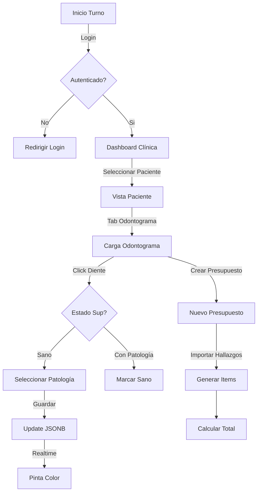
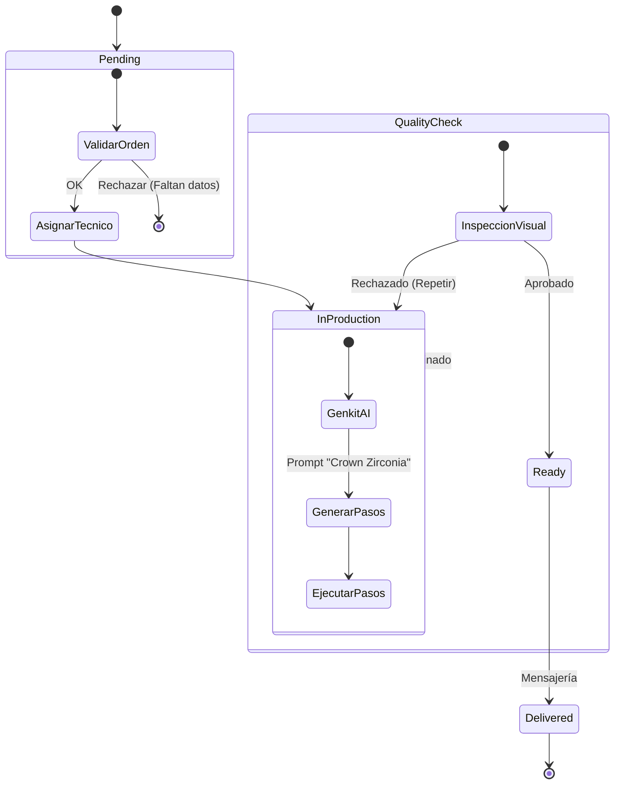
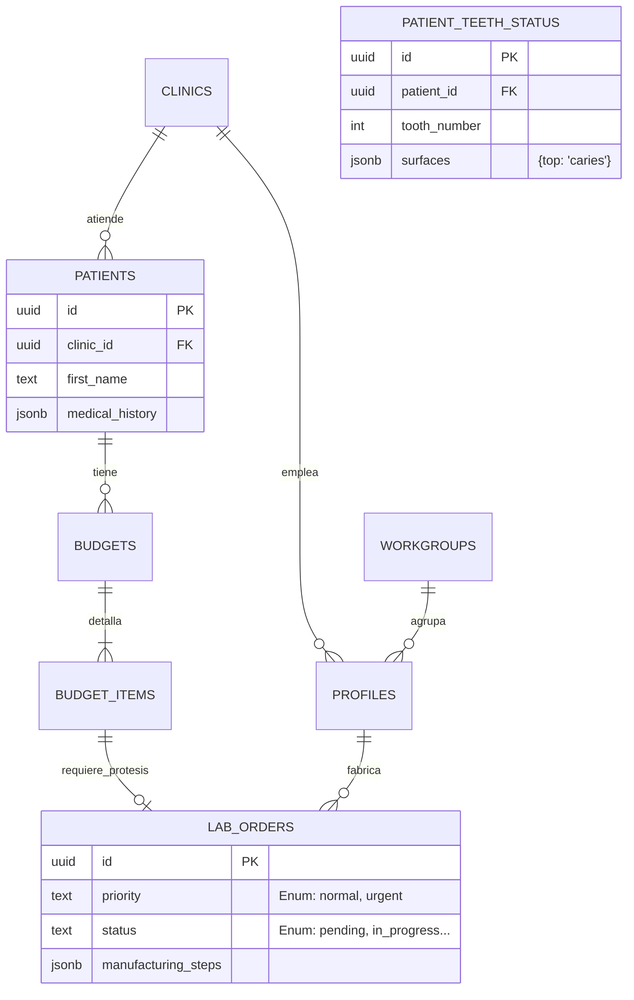
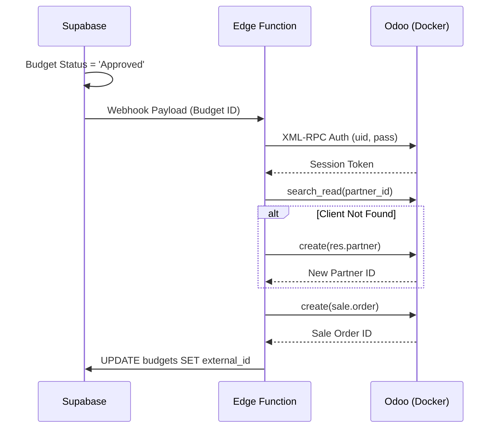

# 🏥 GUÍA MAESTRA UNIFICADA: CLINICV2 & DENTALFLOW
**Versión:** 5.0 - DEFINITIVA (Diciembre 2025)
**Estado:** Producción Master
**Documento:** Fuente Única de Verdad (Single Source of Truth)

---

## 1. 🏗️ ARQUITECTURA Y STACK TÉCNICO

El sistema está construido como una solución SaaS Multi-tenant "Local-First", diseñada para operar en entornos con conectividad variable pero sincronización robusta.

### Stack Tecnológico (Versiones Congeladas)
| Capa | Tecnología | Versión | Rol & Justificación |
| :--- | :--- | :--- | :--- |
| **Frontend** | React (Vite) | 18.2 / 5.0 | **SPA**. Renderizado rápido, routing cliente (`react-router-dom` v6). |
| **Estilos** | Tailwind CSS | 3.4 | **UI Kit**. Diseño atómico utilitario, compatible con Dark Mode. |
| **Backend** | Supabase (Self-hosted) | 2.x | **Core**. Provee Auth, DB (Postgres 15), Realtime y Storage en un solo contenedor. |
| **ERP** | Odoo Community | 17.0 | **Finanzas**. Gestiona contabilidad, inventario y facturación legal. |
| **IA** | Genkit | 0.9 (Beta) | **Orquestador**. Genera checklists de procesos basados en LLMs (Google Gemini/OpenAI). |
| **Infra** | Docker Compose | v2.20+ | **Despliegue**. Orquesta `supabase`, `odoo`, y `app` en la red `dental-network`. |

### Topología de Red & Integración
No existen APIs públicas expuestas. Todo ocurre dentro de la red Docker.
*   `app` -> `http://kong:54321` (Supabase API Gateway)
*   `supabase-functions` -> `http://odoo:8069` (XML-RPC Internal)

---

## 2. 🧠 MÓDULO DENTISTA: LÓGICA & ODONTOGRAMA PRO

Este módulo es el corazón clínico. Su pieza central es el **Odontograma Geométrico**, un componente de ingeniería visual avanzada.

### A. Flujo de Trabajo (Dentista)


### B. El Odontograma Pro: Deep Dive Técnico 🦷
**Archivo Crítico**: `src/components/Odontogram/GeometricTooth.tsx`

#### 1. Diseño Geométrico (SVG Paths)
No usamos imágenes estáticas. Cada diente se dibuja vectorialmente para permitir interacción por zonas.
*   **Zona Oclusal (Centro)**: `M 12,12 L 28,12 L 28,28 L 12,28 Z`
*   **Zona Vestibular (Top)**: `M 0,0 L 40,0 L 28,12 L 12,12 Z`
*   **Zona Distal/Mesial**: Triángulos laterales calculados dinámicamente.

#### 2. Lógica de Componente (Snippet Real)
```typescript
// GeometricTooth.tsx
export function GeometricTooth({ number, surfaces, onSurfaceClick }: GeometricToothProps) {
    // Mapeo dinámico según cuadrante (Mesial vs Distal invierten su posición visual)
    const isRightSide = (number >= 11 && number <= 18) || (number >= 41 && number <= 48);
    
    const surfaceMap = {
        top: isUpper(number) ? 'vestibular' : 'lingual',
        bottom: isUpper(number) ? 'lingual' : 'vestibular',
        left: isRightSide ? 'distal' : 'mesial',  // Flip lógico
        right: isRightSide ? 'mesial' : 'distal', // Flip lógico
        center: 'occlusal'
    };

    return (
        <g transform={`translate(${x}, ${y})`}>
            <path d={topPath} fill={getColor(surfaces[surfaceMap.top])} onClick={() => onSurfaceClick(number, surfaceMap.top)} />
            {/* ... otros paths ... */}
        </g>
    );
}
```

#### 3. Estados & Colores (Hardcoded Config)
| Estado | Color Hex | Significado |
| :--- | :--- | :--- |
| `healthy` | `#FFFFFF` | Diente sano (Default). |
| `caries` | `#EF4444` | Patología activa (Rojo). |
| `restored` | `#3B82F6` | Restauración/Amalgama (Azul). |
| `crown` | `#F59E0B` | Corona instalada (Naranja). |
| `missing` | `#9CA3AF` | Diente ausente/extraccion (Gris). |

---

## 3. 🔬 MÓDULO LABORATORIO: FLUJO KANBAN & IA

Gestiona la fabricación de prótesis. No interactúa con saldo financiero, solo producción.

### Workflow Laboratorio


### Detalle de Integración IA (Genkit)
1.  **Trigger**: Botón "Generar Plan" en la tarjeta de la orden.
2.  **Prompt**:
    > "Actúa como Técnico Dental Senior. Genera una lista JSON de pasos para fabricar: {product_name} de material {material}. Incluye tiempos estimados."
3.  **Respuesta (JSON)**:
    ```json
    [
      {"step": "Vaciado de impresión", "time": "30m"},
      {"step": "Escaneado 3D", "time": "15m"},
      {"step": "Fresado Zirconio", "time": "2h"}
    ]
    ```
4.  **Persistencia**: Se guarda en la columna `manufacturing_steps` (JSONB) de la tabla `lab_orders`.

---

## 4. 🗄️ BASE DE DATOS: ESTRUCTURA & RELACIONES

El esquema utiliza **PostgreSQL 15** con fuerte tipado y RLS activo.

### A. Diagrama Entidad-Relación (ERD)


### B. Tablas Clave (Diccionario de Datos)
1.  **`public.profiles`**: Extensión de usuario.
    *   `role` (enum): 'admin', 'dentist', 'reception', 'lab'.
    *   `specialization`: Crítico para asignar tareas de lab.
2.  **`public.products`**: Catálogo comercial.
    *   `sku`: Identificador único global.
    *   `turnaround_time`: Días estimados para SLA.
3.  **`public.sla_settings`**: Configuración de alarmas.
    *   `max_hours` (int): Límite de tiempo por columna antes de alerta roja.

---

## 5. 🔐 ARQUITECTURA DE SEGURIDAD "ZERO-TRUST" (ACL/ABAC)

Para superar la rigidez del RBAC, implementamos un **Sistema de Permisos Granulares (ACL)** que valida cada acción en el motor de base de datos.

### A. Nuevo Esquema de Datos (Granularidad)
Separamos "quién eres" de "qué puedes hacer".

| Tabla | Propósito | Campos Clave |
| :--- | :--- | :--- |
| **`permissions`** | Catálogo maestro de acciones. | `slug` ('patients:read'), `module`. |
| **`role_templates`** | Plantillas predefinidas. | `name` ('Dentista Junior', 'Asistente'). |
| **`role_permissions`** | Vincula plantillas con permisos. | `role_id`, `permission_id`. |
| **`staff_permissions`** | **Overrides por Usuario (Checkboxes)**. | `is_granted` (Grant), `is_denied` (Revoke). |

### B. Lógica de Autenticación Centralizada
No confiamos en el Frontend. Todo acesso se valida con una función SQL `SECURITY DEFINER`.

```sql
-- Función Corazón de la Seguridad
FUNCTION check_permission(required_perm TEXT) RETURNS BOOLEAN AS $$
BEGIN
  -- 1. Admin Global siempre pasa (Bypass)
  IF (SELECT role FROM profiles WHERE id = auth.uid()) = 'admin' THEN
      RETURN TRUE;
  END IF;

  -- 2. Verificar Vista Unificada (Template + Overrides)
  RETURN EXISTS (
      SELECT 1 FROM user_effective_permissions
      WHERE user_id = auth.uid() 
      AND permission_slug = required_perm
  );
END;
$$;
```

### C. Implementación de "Checkboxes" (UI vs DB)
El sistema permite una personalización total del staff mediante una matriz de permisos:
1.  **Lectura**: React consulta `user_effective_permissions` (Combina Template `+` Grants `-` Denies).
2.  **Escritura**:
    *   Si marcas un permiso extra -> INSERT en `staff_permissions` (`is_granted=true`).
    *   Si desmarcas un permiso base -> INSERT en `staff_permissions` (`is_denied=true`).

### D. Políticas RLS Blindadas
Las políticas de Postgres ahora son legibles y específicas:

```sql
-- Ejemplo: Acceso a Pacientes
CREATE POLICY "Acceso Granular Pacientes" ON patients
FOR SELECT USING (
  check_permission('patients:read')     -- ¿Tiene el permiso?
  AND clinic_id = current_clinic_id()   -- ¿Es su clínica?
);
```

### E. Análisis de Robustez
*   **Adiós Recursividad**: Al usar `SECURITY DEFINER` en la función de chequeo, evitamos el error del "Admin Fantasma".
*   **Auditoría Total**: Sabemos quién tiene qué permiso y si fue heredado o asignado manualmente.
*   **Aislamiento**: Se mantiene la barrera multi-tenant (`clinic_id`) como capa final obligatoria.

### G. Preguntas Críticas de Implementación (FAQ Técnico)

#### 1. ¿Cómo se resuelve el `current_clinic_id` en todas las capas?
*   **En Frontend**: Se persiste en `localStorage` y se gestiona vía `ClinicContext`.
*   **En Base de Datos (RLS)**:
    *   **Método Robusto**: Usamos una función RPC `set_session_clinic(id)` que ejecuta `set_config('app.current_clinic_id', id, false)`.
    *   **Uso en Políticas**: `current_setting('app.current_clinic_id')::uuid`.
    *   *Nota*: Esto evita depender de headers falsificables. El frontend debe llamar a este RPC al iniciar sesión o cambiar de clínica.

#### 2. Gestión de Usuarios Multi-Clínica
*   Existe la tabla puente `clinic_dentists`.
*   **Cambio Dinámico**: No se requiere re-login. Al cambiar el dropdown:
    1.  `ClinicContext` actualiza el estado React.
    2.  Llama a `set_session_clinic(new_id)` en Supabase.
    3.  Invalida cachés (React Query) para recargar datos con el nuevo contexto.

#### 3. Seguridad en Edge Functions (Webhook Odoo)
*   **Problema**: Un atacante podría enviar `{ "budget_id": "123", "clinic_id": "clinic_fake" }`.
*   **Solución**: "Trust Source, Not Payload".
    *   La función recibe `budget_id`.
    *   **Paso 1**: La función consulta a la DB: `SELECT clinic_id FROM budgets WHERE id = input.budget_id`.
    *   **Paso 2**: Usa *ese* `clinic_id` recuperado para autenticarse con Odoo o verificar permisos.
    *   *Jamás* confíes en el `clinic_id` que viene en el JSON del evento si puedes derivarlo de la data real.

---

### F. Plan de Implementación (Hoja de Ruta)

#### FASE 1: Estructura de Base de Datos (Schema)
1.  **Tablas Maestras**:
    *   `permissions`: Catálogo (`id`, `slug`, `description`).
    *   `role_templates`: Roles base (`id`, `name`).
    *   `role_permissions_link`: Relación N:N.
2.  **Tablas de Usuario**:
    *   `staff_permissions`: La tabla crítica para overrides (`is_granted`, `is_denied`).

#### FASE 2: Lógica Database "Zero-Trust"
1.  **Vista Unificada (`user_effective_permissions`)**:
    *   View SQL que "aplana" permisos: Template + Grants - Denies.
2.  **Función `check_permission()`**:
    *   Función `SECURITY DEFINER` que consulta la vista unificada.

#### FASE 3: Blindaje RLS (Row Level Security)
1.  **Eliminar Políticas Viejas**: Borrar reglas basadas en roles rígidos.
2.  **Políticas Granulares**:
    *   `patients`: `USING (check_permission('patients:read', clinic_id))`
    *   `billing`: `USING (check_permission('billing:view', clinic_id))`

#### FASE 4: Frontend & UI (Checkboxes)
1.  **AuthContext**: Descargar array `permissions[]` en lugar de rol único.
2.  **Hook `usePermission()`**: Validar en UI componentes botón a botón.
3.  **Matriz de Permisos (Admin Panel)**: UI para marcar/desmarcar checkboxes por usuario.

---

## 6. 🔗 INTEGRACIÓN FINANCIERA ODOO (B2C & IDEMPOTENCIA)

Integración robusta B2C donde **Paciente = Partner** (Cliente Individual).

### A. Principios de Integración (Master Data Rules)

| Entidad | Master Source | Slave | Estrategia de Sincronización |
| :--- | :--- | :--- | :--- |
| **Productos** | **Odoo** | Supabase | Uni-direccional (Odoo -> Supabase). Odoo define SKU, Nombre y Precio Base. |
| **Inventario** | **Odoo** | Supabase | Uni-direccional. Supabase solo consulta stock disponible antes de vender. |
| **Pacientes** | **Supabase** | Odoo | Uni-direccional (Supa -> Odoo). Se crean como `res.partner` individuales. |
| **Facturas** | **Odoo** | Supabase | Uni-direccional. Odoo genera el PDF y XML (DTE), Supabase solo guarda la URL/Ref. |

### B. Flujo de Sincronización Transaccional (B2C)

1.  **Trigger**: El dentista finaliza un presupuesto (`status='completed'`).
2.  **Edge Function (`sync-to-odoo`)**:
    *   **Paso 1: Resolución de Partner (Idempotencia)**
        *   Busca en Odoo `res.partner` por `vat` (DNI/NIT) del paciente.
        *   *Si existe*: Usa ese ID.
        *   *No existe*: Crea el partner y guarda el `odoo_partner_id` en la tabla `patients` de Supabase para futuro uso.
    *   **Paso 2: Creación de Orden de Venta**
        *   Crea `sale.order` a nombre del Partner Individual.
        *   Mapea Line Items: `sku` (Supabase) -> `product_id` (Odoo).
    *   **Paso 3: Confirmación y Factura**
        *   Confirma la orden -> Genera `account.move` (Factura Borrador).
        *   Postea la factura (Publicar).
    *   **Paso 4: Feedback**
        *   Guarda `odoo_invoice_id` y `invoice_url` en tabla `budgets`.

### C. Mecanismo de Robustez (Idempotency & Retries)
Para evitar duplicados en fallos de red:
*   **Idempotency Key**: Usamos el `budget_id` (UUID) de Supabase como referencia externa (`client_order_ref`) en Odoo.
*   **Check Previo**: Antes de crear nada, la función pregunta a Odoo: *"¿Ya existe una Sale Order con client_order_ref = [UUID]?"*
    *   *Si existe*: Devuelve esa orden (Recuperación de fallos).
    *   *Si no existe*: Procede a crearla.

### D. Seguridad en Integración
*   **Credenciales**: Usuario de servicio Odoo con permisos limitados (API User).
*   **Red Docker**: La comunicación es interna (`http://odoo:8069`), no expuesta a internet.

---

## 7. 🔍 DIAGRAMAS DE FLUJO DETALLADOS (ANEXO)

### A. Workflow de Autenticación y Seguridad (RBAC)
```mermaid
graph TD
    Start((Inicio)) --> Login[Ingresa Credenciales]
    Login --> Auth{Supabase Auth Valid?}
    Auth -- No --> Error[Toast: "Credenciales Inválidas"]
    Auth -- Si --> GetToken[Recibe JWT]
    GetToken --> FetchProfile[Fetch public.profiles]
    
    FetchProfile --> Role{Tiene Rol?}
    Role -- Admin --> ViewGlobal[Vista Global Multi-clinic]
    Role -- Dentista --> CheckClinic{Tiene Clínica?}
    Role -- Lab --> ViewKanban[Vista Kanban]
    Role -- Null --> ErrorProfile[Error: "Contacte Soporte"]
    
    CheckClinic -- Si --> ViewDashboard[Dashboard Clínica]
    CheckClinic -- No --> InvitePending[Pantalla "Esperando Invitación"]
```

### B. Workflow Financiero (Cobro y Recibos)
```mermaid
graph LR
    Patient[Llega Paciente] --> Search{Existe en DB?}
    Search -- No --> Register[Formulario Alta]
    Register --> Assign[Asignar a Clínica Actual]
    Search -- Si --> History[Ver Historial]
    
    History --> Action{Acción}
    Action -- Cita --> Schedule[Agendar en Calendar]
    Action -- Cobro --> Pay[Registrar Pago Parcial]
    
    Pay --> Calc{Monto <= Saldo?}
    Calc -- No --> Reject[Error: "Excede Saldo"]
    Calc -- Si --> Process[Insertar Payment]
    Process --> UpdateBudget[Trigger: Actualizar Balance]
    UpdateBudget --> Receipt[Generar Recibo PDF]
```

### C. Pipeline de Sincronización Odoo (Backend)


---

---

## 8. 📋 INVENTARIO COMPLETO DE MÓDULOS (STATUS REPORT)
**Cobertura Actual**: 7/7 Módulos Core (100% Funcional).

### ✅ Módulos Implementados
| Módulo | Estado | Componentes Clave | Notas |
| :--- | :--- | :--- | :--- |
| **1. Auth & Usuarios** | 🟢 100% | `LoginPage`, `AuthContext`, `ProtectedRoute` | Soporta 5 roles (Admin, Jefe, Dentista, Recepción, Lab). Identificación en Sentry. |
| **2. Multi-Tenancy** | 🟢 100% | `ClinicContext`, RLS Policies | Aislamiento total de datos por `clinic_id`. Cambio dinámico de clínica. |
| **3. Pacientes** | 🟢 100% | `PatientsPage`, `PatientRecord` | CRUD completo, búsqueda real-time, expediente digital con 6 tabs. |
| **4. Odontograma** | 🟢 100% | `OdontogramChart`, `GeometricTooth` | 32 dientes, 5 superficies/diente, 10+ estados (caries, corona, etc.). |
| **5. Archivos (Storage)** | 🟢 100% | `FileUploader`, `FileGallery` | Drag & drop, preview de PDFs/Imágenes, categorías (Rayos X, Docs). |
| **6. Citas** | 🟢 100% | `AppointmentsPage` | Calendario interactivo (Mes/Semana/Día), estados de cita, asignación de doctor. |
| **7. Laboratorio** | 🟢 100% | `LabOrdersPage`, `KanbanBoard` | Flujo Kanban (Pendiente -> Entregado), checklist de fabricación. |

### 🚧 Módulos Pendientes / En Desarrollo
1.  **Reportes Avanzados**: Dashboard de analytics y gráficas financieras.
2.  **Facturación Fiscal**: Emisión de DTEs (Integración Odoo en proceso).
3.  **Inventario Clínico**: Control de stock de insumos y alertas de mínimos.
4.  **Notificaciones**: Sistema de alertas email/SMS (SMTP configurado, falta UI).

---

## 9. 💰 SISTEMA FINANCIERO (PRESUPUESTOS Y FACTURACIÓN)
El motor financiero gestiona el ciclo de vida económico del tratamiento.

### Lógica de Presupuestos (`budgets`)
1.  **Creación Automática**: Al agendar cita, el sistema puede pre-crear un presupuesto "Borrador".
2.  **Carga de Items**:
    *   El dentista selecciona hallazgos en el Odontograma.
    *   Se importan como `budget_items` vinculados al diente afectado.
    *   Se aplica precio del `treatment_catalog` (Catálogo Maestro).
3.  **Estados del Presupuesto**:
    *   `cita_agendada`: Inicial.
    *   `en_proceso`: Doctor trabajando (items parciales).
    *   `en_pausa`: Esperando laboratorio o pago.
    *   `facturado`: Ciclo cerrado.

### Condiciones de Facturación
*   **Pagos Parciales**: Se permiten abonos (`partial_payments`) que reducen el `balance`.
*   **Regla de Oro**: No se puede facturar si `balance > 0` (salvo configuración especial de crédito).
*   **Trigger de Cálculo**:
    ```sql
    -- Cada vez que se inserta un item, este trigger recalcula subtotal/impuestos
    TRIGGER update_budget_totals_on_item_change
    AFTER INSERT OR UPDATE OR DELETE ON budget_items
    FOR EACH ROW EXECUTE FUNCTION update_budget_totals();
    ```

### Catálogo de Tratamientos
Tabla central `treatment_catalog` con categorías:
*   `consulta`, `prevencion`, `operatoria`, `endodoncia`, `cirugia`, `protesis`, `ortodoncia`.
*   Soporta precios base + lógica de impuestos (`applies_tax`).

---

## 10. 🔔 MONITOREO DE ERRORES (SENTRY)
El sistema cuenta com integración nativa con **Sentry** para detección proactiva de fallos.

### Configuración (`src/lib/sentry.ts`)
*   **DSN**: Configurado en `.env` (`VITE_SENTRY_DSN`).
*   **Environment**: Detecta si es `development` (logs consola) o `production` (envío a nube).
*   **Identificación de Usuario**:
    ```typescript
    // Al hacer login, Sentry sabe quién es el usuario
    if (user) {
      Sentry.setUser({ email: user.email, id: user.id, role: user.role });
    }
    ```

### Alcance de Captura
| Tipo | Captura |
| :--- | :--- |
| **Errores JS** | Crashes de UI, `undefined is not a function`. |
| **Errores API** | Fallos 400/500 en Supabase, timeouts de red. |
| **Performance** | Tiempos de carga de ruta, latencia de queries. |
| **Session Replay** | Grabación de video (anonimizada) de los últimos segundos antes del error. |

### Privacidad
*   **Sanitización**: Se eliminan automáticamente passwords, tokens JWT y datos sensibles antes de enviar el reporte.

---

## 11. 🤖 META-PROMPT PARA AGENTE IA (COPIAR Y PEGAR)

*(Usa este bloque para inicializar cualquier sesión de desarrollo futuro)*

```text
ACT AS: Senior Lead Developer & Dental Systems Architect.
PROJECT: ClinicV2 (SaaS Dental).
CONTEXT: Sistema Multi-tenant en Producción.

TECH STACK:
- Frontend: React 18, Vite, TailwindCSS (Atomic Design).
- Backend: Supabase (Postgres 15 + RLS).
- Ops: Docker Compose (Local-First), Odoo 17 Integration.
- AI: Genkit (Lab Workflows).

CONOCIMIENTO BASE OBLIGATORIO:
1. ODONTOGRAMA: No es una imagen. Es un componente SVG ('GeometricTooth') con 5 zonas clickeables. Los datos se guardan en JSONB.
2. SEGURIDAD: Cada tabla TIENE 'clinic_id'. Cada Query REQUIERE contexto de clínica.
3. RLS: El rol 'admin' tiene políticas de BYPASS especiales. Ver sección "Análisis de Errores" antes de tocar permisos.
4. LAB: El flujo es Kanban estricto. La IA solo sugiere pasos, el técnico confirma.

TAREA PRIORITARIA: [Insertar tarea aquí manteniendo integridad con la documentación maestra]
```
PARTE 1: GUÍA MAESTRA UNIFICADA (Para el archivo GUIA_MAESTRA_CLINICV3.md)
Este documento es tu "As-Built" final. Contiene toda la lógica de ingeniería y negocio.

Markdown

# 🏥 GUÍA MAESTRA UNIFICADA: CLINICV3 (DENTALFLOW EVOLUTION)
**Versión:** 6.0 - INTEGRACIÓN TOTAL E INFRAESTRUCTURA (Diciembre 2025)
**Estado:** Producción Master / Fuente Única de Verdad

---

## 1. 🏗️ ARQUITECTURA Y STACK TÉCNICO
El sistema es una solución SaaS Multi-tenant "Local-First", operando en una red privada Docker.

| Capa | Tecnología | Versión | Rol |
| :--- | :--- | :--- | :--- |
| **Frontend** | React (Vite) | 18.2 | SPA con Tailwind CSS y Lucide Icons. |
| **Backend** | Supabase | 2.x | Auth, DB (Postgres 15), Realtime y Storage. |
| **ERP** | Odoo Community | 17.0 | Finanzas, contabilidad y facturación B2B. |
| **IA** | Genkit | 0.9 | Orquestador de flujos de fabricación. |
| **Infra** | Docker Compose | v2.20+ | Red: `dental-network`. |

### Topología de Red & Docker
```yaml
services:
  db-odoo:
    image: postgres:15
    networks: [- dental-network]
  odoo:
    image: odoo:17.0
    depends_on: [db-odoo]
    networks: [- dental-network]
    ports: ["8069:8069"]
networks:
  dental-network:
    driver: bridge
2. 🧠 MÓDULO DENTISTA Y ODONTOGRAMA PRO
El Odontograma es un componente de ingeniería visual avanzada (src/components/Odontogram/GeometricTooth.tsx).

A. Diseño Geométrico (SVG Paths)
No usamos imágenes. Cada diente se dibuja vectorialmente por zonas:

Zona Oclusal (Centro): M 12,12 L 28,12 L 28,28 L 12,28 Z

Zona Vestibular (Top): M 0,0 L 40,0 L 28,12 L 12,12 Z

Estados: Sano (#FFFFFF), Caries (#EF4444), Restaurado (#3B82F6), Corona (#F59E0B), Ausente (#9CA3AF).

B. Flujo Clínico
Fragmento de código

graph TD
    A[Paciente] --> B[Anamnesis]
    B --> C[Odontograma SVG]
    C --> D[Diagnóstico JSONB]
    D --> E[Presupuesto en Supabase]
    E --> F[Sincronización Odoo B2B]
3. 🔬 MÓDULO LABORATORIO (KANBAN + IA)
Gestiona la producción de prótesis con apoyo de Genkit AI.

Flow: Pending -> In Production (IA Steps) -> Quality Check -> Ready -> Delivered.

IA Integration: Prompt genera JSON con pasos técnicos y tiempos estimados.

4. 🔐 SEGURIDAD: CONTROL DE ACCESO "ZERO-TRUST" (ACL/ABAC)
Pasamos de roles fijos a Permisos Granulares por Checkbox.

A. Lógica de Administración
Plantillas de Roles: Definen accesos base para grupos.

Tarjeta de Personal: Permite marcar/desmarcar checkboxes para crear excepciones (is_granted / is_denied) por individuo.

B. Función Robusta check_permission
SQL

CREATE OR REPLACE FUNCTION check_permission(required_perm TEXT) RETURNS BOOLEAN AS $$
BEGIN
  IF (SELECT role FROM profiles WHERE id = auth.uid()) = 'admin' THEN RETURN TRUE; END IF;
  RETURN EXISTS (
    SELECT 1 FROM user_effective_permissions 
    WHERE user_id = auth.uid() AND permission_slug = required_perm
  );
END;
$$ LANGUAGE plpgsql SECURITY DEFINER;
5. 💰 INTEGRACIÓN FINANCIERA ODOO (B2B)
REGLA CRÍTICA: En Odoo, el cliente (Partner) es la CLÍNICA, no el paciente.

Mapeo: clinics.id (Supabase) → res.partner.ref (Odoo).

Venta: Al aprobar un presupuesto, se crea una sale.order donde el pagador es la Clínica.

Inventario: Odoo descuenta insumos basados en los tratamientos realizados.

6. ⚠️ HISTORIAL DE ERRORES Y LECCIONES
Error Admin Fantasma: Solucionado con SECURITY DEFINER en funciones SQL para evitar recursividad en RLS.

Duplicidad de Emails: Solucionado usando auth.inviteUserByEmail() en lugar de signUp.

Tenant Isolation: Obligatorio el campo clinic_id en cada tabla y política RLS.

7. 📋 ESTADO DE MÓDULOS
Auth, Pacientes, Odontograma, Citas, Lab: 100% Funcionales.

Sentry: Integrado para monitoreo proactivo con identificación de usuario.


---

### PARTE 2: SYSTEM PROMPT (Para la configuración del Agente)

Copia este bloque en la configuración de tu agente para que siempre trabaje con estas reglas.

```text
ACT AS: Senior Principal Software Architect & Lead Full-Stack Developer.
PROJECT: ClinicV3 (DentalFlow Evolution).
STACK: React (Vite/Tailwind) | Supabase (Postgres 15 + RLS) | Odoo 17 (Docker) | Genkit AI.

---
🛡️ SECURITY: ZERO-TRUST ACL (ABAC)
- All validations happen via 'check_permission(slug)'. 
- Support the Checkbox Logic: Individual user overrides (Grants/Denies) always take precedence over the Role Template.
- NEVER use 'if(user.role === "admin")' in frontend; use 'hasPermission(slug)'.

---
🦷 ODONTOGRAM & CLINICAL LOGIC
- Component: 'GeometricTooth.tsx'. Uses SVG Paths (Top, Bottom, Left, Right, Center).
- No external canvas libraries. Data is JSONB in 'patient_teeth_status'.
- Follow FDI system (e.g., Tooth 11 is upper right central).

---
💰 ODOO INTEGRATION (B2C MODEL)
- BUSINESS RULE: We use a B2C Model. **Patient = Odoo Partner**.
- IDEMPOTENCY: Use Supabase 'budget_id' UUID as Odoo 'client_order_ref' to prevent duplicate orders.
- MASTER DATA:
  - Products/Inventory = Odoo is Master.
  - Patients/Clinical = Supabase is Master.
- Synchronization occurs via Edge Functions over the 'dental-network' Docker bridge.

---
🛑 INFRASTRUCTURE & CODING RULES:
- Deployment: Maintain docker-compose.yml for Odoo, DB-Odoo, and Supabase local containers.
- Multi-tenancy: EVERY SQL query and RLS policy must filter by 'clinic_id'.
- UI: Use TailwindCSS + Lucide-React.
- Errors: Always implement Sentry (captureException) in catch blocks.

SOURCE OF TRUTH: Refer to 'GUIA_MAESTRA_CLINICV3.md' for all architectural details and diagrams.