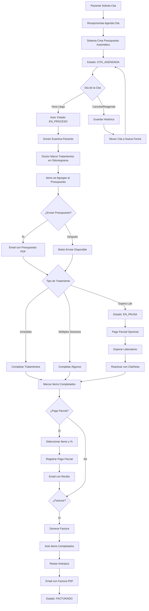

# 💰 Sistema de Presupuestos y Facturación - DIAGRAMA DEFINITIVO

**Fecha**: 21 de Diciembre, 2024  
**Módulo**: Presupuestos, Pagos Parciales y Facturación  
**Estado**: ✅ DISEÑO COMPLETO APROBADO

---

## 🎯 FLUJO COMPLETO DEL SISTEMA



---

## 🗄️ ESTRUCTURA DE BASE DE DATOS COMPLETA

### **1. BUDGETS (Presupuestos)**

```sql
CREATE TABLE budgets (
  id UUID PRIMARY KEY DEFAULT gen_random_uuid(),
  budget_number TEXT UNIQUE NOT NULL, -- PRES-2024-0001
  clinic_id UUID REFERENCES clinics(id) NOT NULL,
  patient_id UUID REFERENCES patients(id) NOT NULL,
  appointment_id UUID REFERENCES appointments(id), -- Puede ser NULL
  
  -- Estados
  status TEXT NOT NULL DEFAULT 'cita_agendada',
  -- 'cita_agendada', 'en_proceso', 'en_pausa', 'cita_cancelada', 'facturado'
  
  -- Totales
  subtotal DECIMAL(10,2) DEFAULT 0,
  tax_percent DECIMAL(5,2) DEFAULT 12.00, -- IVA Guatemala
  tax_amount DECIMAL(10,2) DEFAULT 0,
  total DECIMAL(10,2) DEFAULT 0,
  paid_amount DECIMAL(10,2) DEFAULT 0, -- Suma de pagos parciales
  balance DECIMAL(10,2) DEFAULT 0,
  
  -- Metadata
  notes TEXT,
  sent_at TIMESTAMP, -- Cuando se envió por email
  created_by UUID REFERENCES auth.users(id),
  created_at TIMESTAMP DEFAULT NOW(),
  updated_at TIMESTAMP DEFAULT NOW(),
  
  CONSTRAINT valid_status CHECK (status IN (
    'cita_agendada', 'en_proceso', 'en_pausa', 'cita_cancelada', 'facturado'
  ))
);

-- Índices
CREATE INDEX idx_budgets_clinic ON budgets(clinic_id);
CREATE INDEX idx_budgets_patient ON budgets(patient_id);
CREATE INDEX idx_budgets_status ON budgets(status);
CREATE INDEX idx_budgets_created_at ON budgets(created_at DESC);

-- Trigger para auto-numeración
CREATE OR REPLACE FUNCTION generate_budget_number()
RETURNS TRIGGER AS $$
DECLARE
  next_num INTEGER;
  year_str TEXT;
BEGIN
  year_str := TO_CHAR(NOW(), 'YYYY');
  
  SELECT COALESCE(MAX(CAST(SUBSTRING(budget_number FROM 'PRES-' || year_str || '-(\d+)') AS INTEGER)), 0) + 1
  INTO next_num
  FROM budgets
  WHERE budget_number LIKE 'PRES-' || year_str || '-%';
  
  NEW.budget_number := 'PRES-' || year_str || '-' || LPAD(next_num::TEXT, 4, '0');
  RETURN NEW;
END;
$$ LANGUAGE plpgsql;

CREATE TRIGGER set_budget_number
  BEFORE INSERT ON budgets
  FOR EACH ROW
  WHEN (NEW.budget_number IS NULL)
  EXECUTE FUNCTION generate_budget_number();

-- Trigger para actualizar updated_at
CREATE TRIGGER update_budgets_updated_at
  BEFORE UPDATE ON budgets
  FOR EACH ROW
  EXECUTE FUNCTION handle_updated_at();
```

### **2. BUDGET_ITEMS (Items del Presupuesto)**

```sql
CREATE TABLE budget_items (
  id UUID PRIMARY KEY DEFAULT gen_random_uuid(),
  budget_id UUID REFERENCES budgets(id) ON DELETE CASCADE NOT NULL,
  treatment_catalog_id UUID REFERENCES treatment_catalog(id),
  tooth_number INTEGER, -- Si aplica (del odontograma)
  
  -- Descripción
  description TEXT NOT NULL,
  quantity INTEGER DEFAULT 1,
  unit_price DECIMAL(10,2) NOT NULL,
  
  -- Descuentos e impuestos por item
  discount_percent DECIMAL(5,2) DEFAULT 0,
  discount_amount DECIMAL(10,2) DEFAULT 0,
  tax_percent DECIMAL(5,2) DEFAULT 12.00,
  tax_amount DECIMAL(10,2) DEFAULT 0,
  total DECIMAL(10,2) NOT NULL,
  
  -- Estados
  item_status TEXT DEFAULT 'pendiente',
  -- 'pendiente', 'en_proceso', 'completado', 'cancelado'
  
  payment_status TEXT DEFAULT 'no_pagado',
  -- 'no_pagado', 'parcial', 'pagado'
  
  paid_amount DECIMAL(10,2) DEFAULT 0,
  
  -- Metadata
  completed_at TIMESTAMP,
  completed_by UUID REFERENCES auth.users(id),
  notes TEXT,
  created_at TIMESTAMP DEFAULT NOW(),
  
  CONSTRAINT valid_item_status CHECK (item_status IN (
    'pendiente', 'en_proceso', 'completado', 'cancelado'
  )),
  CONSTRAINT valid_payment_status CHECK (payment_status IN (
    'no_pagado', 'parcial', 'pagado'
  ))
);

-- Índices
CREATE INDEX idx_budget_items_budget ON budget_items(budget_id);
CREATE INDEX idx_budget_items_treatment ON budget_items(treatment_catalog_id);
CREATE INDEX idx_budget_items_status ON budget_items(item_status);

-- Trigger para calcular totales del item
CREATE OR REPLACE FUNCTION calculate_budget_item_total()
RETURNS TRIGGER AS $$
BEGIN
  -- Calcular descuento
  NEW.discount_amount := (NEW.quantity * NEW.unit_price) * (NEW.discount_percent / 100);
  
  -- Base imponible
  DECLARE
    taxable_amount DECIMAL(10,2);
  BEGIN
    taxable_amount := (NEW.quantity * NEW.unit_price) - NEW.discount_amount;
    
    -- Calcular impuesto
    NEW.tax_amount := taxable_amount * (NEW.tax_percent / 100);
    
    -- Total del item
    NEW.total := taxable_amount + NEW.tax_amount;
  END;
  
  RETURN NEW;
END;
$$ LANGUAGE plpgsql;

CREATE TRIGGER calculate_item_total
  BEFORE INSERT OR UPDATE ON budget_items
  FOR EACH ROW
  EXECUTE FUNCTION calculate_budget_item_total();

-- Trigger para actualizar totales del presupuesto
CREATE OR REPLACE FUNCTION update_budget_totals()
RETURNS TRIGGER AS $$
BEGIN
  UPDATE budgets
  SET
    subtotal = (
      SELECT COALESCE(SUM((quantity * unit_price) - discount_amount), 0)
      FROM budget_items
      WHERE budget_id = COALESCE(NEW.budget_id, OLD.budget_id)
    ),
    tax_amount = (
      SELECT COALESCE(SUM(tax_amount), 0)
      FROM budget_items
      WHERE budget_id = COALESCE(NEW.budget_id, OLD.budget_id)
    ),
    total = (
      SELECT COALESCE(SUM(total), 0)
      FROM budget_items
      WHERE budget_id = COALESCE(NEW.budget_id, OLD.budget_id)
    ),
    balance = (
      SELECT COALESCE(SUM(total), 0) - COALESCE(paid_amount, 0)
      FROM budget_items
      WHERE budget_id = COALESCE(NEW.budget_id, OLD.budget_id)
    ),
    updated_at = NOW()
  WHERE id = COALESCE(NEW.budget_id, OLD.budget_id);
  
  RETURN COALESCE(NEW, OLD);
END;
$$ LANGUAGE plpgsql;

CREATE TRIGGER update_budget_totals_on_item_change
  AFTER INSERT OR UPDATE OR DELETE ON budget_items
  FOR EACH ROW
  EXECUTE FUNCTION update_budget_totals();
```

### **3. TREATMENT_CATALOG (Catálogo de Tratamientos)**

```sql
CREATE TABLE treatment_catalog (
  id UUID PRIMARY KEY DEFAULT gen_random_uuid(),
  clinic_id UUID REFERENCES clinics(id), -- NULL = global
  
  -- Información del tratamiento
  code TEXT, -- Código interno
  name TEXT NOT NULL,
  description TEXT,
  category TEXT NOT NULL,
  -- 'consulta', 'prevencion', 'operatoria', 'endodoncia', 'cirugia',
  -- 'protesis', 'implantes', 'ortodoncia', 'pediatria', 'estetica', 'periodoncia'
  
  -- Precios
  default_price DECIMAL(10,2) DEFAULT 0,
  applies_tax BOOLEAN DEFAULT TRUE,
  
  -- SAT (para factura electrónica futura)
  sat_code TEXT,
  
  -- Metadata
  is_active BOOLEAN DEFAULT TRUE,
  created_by UUID REFERENCES auth.users(id),
  created_at TIMESTAMP DEFAULT NOW(),
  updated_at TIMESTAMP DEFAULT NOW()
);

-- Índices
CREATE INDEX idx_treatment_catalog_clinic ON treatment_catalog(clinic_id);
CREATE INDEX idx_treatment_catalog_category ON treatment_catalog(category);
CREATE INDEX idx_treatment_catalog_active ON treatment_catalog(is_active);
```

### **4. PARTIAL_PAYMENTS (Pagos Parciales)**

```sql
CREATE TABLE partial_payments (
  id UUID PRIMARY KEY DEFAULT gen_random_uuid(),
  budget_id UUID REFERENCES budgets(id) ON DELETE CASCADE NOT NULL,
  clinic_id UUID REFERENCES clinics(id) NOT NULL,
  
  -- Información del pago
  amount DECIMAL(10,2) NOT NULL,
  payment_method TEXT NOT NULL,
  -- 'cash', 'card', 'transfer', 'check'
  payment_date DATE NOT NULL,
  reference TEXT,
  
  -- Items pagados (JSON)
  items_paid JSONB NOT NULL,
  -- Ejemplo: [{"item_id": "uuid", "amount": 500, "percent": 100}]
  
  -- Metadata
  notes TEXT,
  receipt_sent_at TIMESTAMP,
  created_by UUID REFERENCES auth.users(id),
  created_at TIMESTAMP DEFAULT NOW(),
  
  CONSTRAINT valid_payment_method CHECK (payment_method IN (
    'cash', 'card', 'transfer', 'check'
  )),
  CONSTRAINT positive_amount CHECK (amount > 0)
);

-- Índices
CREATE INDEX idx_partial_payments_budget ON partial_payments(budget_id);
CREATE INDEX idx_partial_payments_date ON partial_payments(payment_date DESC);

-- Trigger para actualizar paid_amount del presupuesto
CREATE OR REPLACE FUNCTION update_budget_paid_amount()
RETURNS TRIGGER AS $$
BEGIN
  UPDATE budgets
  SET
    paid_amount = (
      SELECT COALESCE(SUM(amount), 0)
      FROM partial_payments
      WHERE budget_id = COALESCE(NEW.budget_id, OLD.budget_id)
    ),
    balance = total - (
      SELECT COALESCE(SUM(amount), 0)
      FROM partial_payments
      WHERE budget_id = COALESCE(NEW.budget_id, OLD.budget_id)
    ),
    updated_at = NOW()
  WHERE id = COALESCE(NEW.budget_id, OLD.budget_id);
  
  RETURN COALESCE(NEW, OLD);
END;
$$ LANGUAGE plpgsql;

CREATE TRIGGER update_budget_paid_on_partial_payment
  AFTER INSERT OR UPDATE OR DELETE ON partial_payments
  FOR EACH ROW
  EXECUTE FUNCTION update_budget_paid_amount();
```

### **5. APPOINTMENTS (Actualización - Histórico de Citas)**

```sql
-- Agregar campos a la tabla existente appointments
ALTER TABLE appointments ADD COLUMN IF NOT EXISTS budget_id UUID REFERENCES budgets(id);
ALTER TABLE appointments ADD COLUMN IF NOT EXISTS rescheduled_count INTEGER DEFAULT 0;
ALTER TABLE appointments ADD COLUMN IF NOT EXISTS cancellation_count INTEGER DEFAULT 0;

-- Tabla de histórico de cambios de citas
CREATE TABLE appointment_history (
  id UUID PRIMARY KEY DEFAULT gen_random_uuid(),
  appointment_id UUID REFERENCES appointments(id) ON DELETE CASCADE NOT NULL,
  clinic_id UUID REFERENCES clinics(id) NOT NULL,
  
  -- Acción realizada
  action TEXT NOT NULL,
  -- 'created', 'rescheduled', 'cancelled', 'completed', 'no_show'
  
  -- Datos anteriores
  previous_date TIMESTAMP,
  previous_status TEXT,
  
  -- Datos nuevos
  new_date TIMESTAMP,
  new_status TEXT,
  
  -- Razón
  reason TEXT,
  notes TEXT,
  
  -- Metadata
  performed_by UUID REFERENCES auth.users(id),
  created_at TIMESTAMP DEFAULT NOW(),
  
  CONSTRAINT valid_action CHECK (action IN (
    'created', 'rescheduled', 'cancelled', 'completed', 'no_show'
  ))
);

-- Índices
CREATE INDEX idx_appointment_history_appointment ON appointment_history(appointment_id);
CREATE INDEX idx_appointment_history_created_at ON appointment_history(created_at DESC);
```

### **6. SMTP_SETTINGS (Configuración de Email)**

```sql
CREATE TABLE smtp_settings (
  id UUID PRIMARY KEY DEFAULT gen_random_uuid(),
  clinic_id UUID REFERENCES clinics(id), -- NULL = configuración global
  
  -- Configuración SMTP
  host TEXT NOT NULL,
  port INTEGER NOT NULL,
  username TEXT NOT NULL,
  password TEXT NOT NULL, -- Encriptado
  encryption TEXT DEFAULT 'tls',
  -- 'tls', 'ssl', 'none'
  
  -- Remitente
  from_email TEXT NOT NULL,
  from_name TEXT NOT NULL,
  
  -- Estado
  is_active BOOLEAN DEFAULT TRUE,
  is_default BOOLEAN DEFAULT FALSE,
  
  -- Test
  last_test_at TIMESTAMP,
  last_test_success BOOLEAN,
  
  -- Metadata
  created_by UUID REFERENCES auth.users(id),
  created_at TIMESTAMP DEFAULT NOW(),
  updated_at TIMESTAMP DEFAULT NOW(),
  
  CONSTRAINT valid_encryption CHECK (encryption IN ('tls', 'ssl', 'none')),
  CONSTRAINT unique_default_per_clinic UNIQUE (clinic_id, is_default) WHERE is_default = TRUE
);

-- Índices
CREATE INDEX idx_smtp_settings_clinic ON smtp_settings(clinic_id);
CREATE INDEX idx_smtp_settings_active ON smtp_settings(is_active);
```

### **7. ROLE_PERMISSIONS (Permisos Configurables)**

```sql
CREATE TABLE role_permissions (
  id UUID PRIMARY KEY DEFAULT gen_random_uuid(),
  clinic_id UUID REFERENCES clinics(id) NOT NULL,
  role TEXT NOT NULL,
  -- 'admin', 'dentist', 'reception', 'lab'
  
  -- Permisos de Presupuestos
  can_create_budget BOOLEAN DEFAULT FALSE,
  can_edit_budget BOOLEAN DEFAULT FALSE,
  can_delete_budget BOOLEAN DEFAULT FALSE,
  can_send_budget BOOLEAN DEFAULT FALSE,
  
  -- Permisos de Items
  can_add_items BOOLEAN DEFAULT FALSE,
  can_edit_items BOOLEAN DEFAULT FALSE,
  can_mark_completed BOOLEAN DEFAULT FALSE,
  
  -- Permisos de Pagos
  can_register_partial_payment BOOLEAN DEFAULT FALSE,
  can_delete_payment BOOLEAN DEFAULT FALSE,
  
  -- Permisos de Facturación
  can_generate_invoice BOOLEAN DEFAULT FALSE,
  can_cancel_invoice BOOLEAN DEFAULT FALSE,
  
  -- Permisos de Citas
  can_create_appointment BOOLEAN DEFAULT FALSE,
  can_reschedule_appointment BOOLEAN DEFAULT FALSE,
  can_cancel_appointment BOOLEAN DEFAULT FALSE,
  
  -- Permisos de Configuración
  can_configure_smtp BOOLEAN DEFAULT FALSE,
  can_edit_catalog BOOLEAN DEFAULT FALSE,
  can_manage_permissions BOOLEAN DEFAULT FALSE,
  
  -- Permisos de Reportes
  can_view_reports BOOLEAN DEFAULT FALSE,
  can_export_reports BOOLEAN DEFAULT FALSE,
  
  -- Metadata
  created_at TIMESTAMP DEFAULT NOW(),
  updated_at TIMESTAMP DEFAULT NOW(),
  
  CONSTRAINT unique_clinic_role UNIQUE (clinic_id, role),
  CONSTRAINT valid_role CHECK (role IN ('admin', 'dentist', 'reception', 'lab'))
);

-- Insertar permisos por defecto
INSERT INTO role_permissions (clinic_id, role, 
  can_create_budget, can_edit_budget, can_send_budget, can_add_items, can_edit_items,
  can_mark_completed, can_register_partial_payment, can_generate_invoice,
  can_create_appointment, can_reschedule_appointment, can_cancel_appointment,
  can_configure_smtp, can_edit_catalog, can_manage_permissions,
  can_view_reports, can_export_reports)
SELECT 
  id as clinic_id,
  'admin' as role,
  TRUE, TRUE, TRUE, TRUE, TRUE, TRUE, TRUE, TRUE, TRUE, TRUE, TRUE, TRUE, TRUE, TRUE, TRUE, TRUE
FROM clinics;

-- Permisos para dentistas
INSERT INTO role_permissions (clinic_id, role,
  can_create_budget, can_edit_budget, can_send_budget, can_add_items, can_edit_items,
  can_mark_completed, can_register_partial_payment, can_generate_invoice,
  can_create_appointment, can_reschedule_appointment, can_cancel_appointment,
  can_edit_catalog, can_view_reports, can_export_reports)
SELECT 
  id as clinic_id,
  'dentist' as role,
  TRUE, TRUE, TRUE, TRUE, TRUE, TRUE, TRUE, TRUE, TRUE, TRUE, TRUE, TRUE, TRUE, TRUE
FROM clinics;

-- Permisos para recepción
INSERT INTO role_permissions (clinic_id, role,
  can_send_budget, can_register_partial_payment, can_generate_invoice,
  can_create_appointment, can_reschedule_appointment, can_cancel_appointment,
  can_view_reports)
SELECT 
  id as clinic_id,
  'reception' as role,
  TRUE, TRUE, TRUE, TRUE, TRUE, TRUE, TRUE
FROM clinics;

-- Permisos para laboratorio
INSERT INTO role_permissions (clinic_id, role, can_mark_completed)
SELECT 
  id as clinic_id,
  'lab' as role,
  TRUE
FROM clinics;
```

---

## 📊 CATÁLOGO DE TRATAMIENTOS PARA GUATEMALA

```sql
-- Insertar catálogo de tratamientos (precios sin IVA)
INSERT INTO treatment_catalog (clinic_id, code, name, category, default_price, applies_tax) VALUES
-- CONSULTAS Y DIAGNÓSTICO
(NULL, 'CONS-001', 'Consulta General', 'consulta', 100.00, TRUE),
(NULL, 'CONS-002', 'Consulta de Emergencia', 'consulta', 150.00, TRUE),
(NULL, 'CONS-003', 'Consulta de Ortodoncia', 'consulta', 200.00, TRUE),
(NULL, 'RAD-001', 'Radiografía Periapical', 'consulta', 50.00, TRUE),
(NULL, 'RAD-002', 'Radiografía Panorámica', 'consulta', 150.00, TRUE),

-- PREVENCIÓN Y LIMPIEZA
(NULL, 'PREV-001', 'Limpieza Dental (Profilaxis)', 'prevencion', 200.00, TRUE),
(NULL, 'PREV-002', 'Aplicación de Flúor', 'prevencion', 80.00, TRUE),
(NULL, 'PREV-003', 'Sellantes de Fosas y Fisuras', 'prevencion', 100.00, TRUE),

-- OPERATORIA DENTAL
(NULL, 'OPER-001', 'Resina Simple (1 superficie)', 'operatoria', 200.00, TRUE),
(NULL, 'OPER-002', 'Resina Compuesta (2-3 superficies)', 'operatoria', 300.00, TRUE),
(NULL, 'OPER-003', 'Amalgama', 'operatoria', 150.00, TRUE),

-- ENDODONCIA
(NULL, 'ENDO-001', 'Endodoncia Incisivo', 'endodoncia', 800.00, TRUE),
(NULL, 'ENDO-002', 'Endodoncia Premolar', 'endodoncia', 1000.00, TRUE),
(NULL, 'ENDO-003', 'Endodoncia Molar', 'endodoncia', 1200.00, TRUE),
(NULL, 'ENDO-004', 'Retratamiento Endodóntico', 'endodoncia', 1500.00, TRUE),

-- CIRUGÍA ORAL
(NULL, 'CIR-001', 'Extracción Simple', 'cirugia', 150.00, TRUE),
(NULL, 'CIR-002', 'Extracción Compleja', 'cirugia', 300.00, TRUE),
(NULL, 'CIR-003', 'Extracción de Cordal Incluida', 'cirugia', 600.00, TRUE),
(NULL, 'CIR-004', 'Cirugía de Frenillo', 'cirugia', 500.00, TRUE),

-- PRÓTESIS FIJA
(NULL, 'PROT-001', 'Corona de Metal-Porcelana', 'protesis', 2000.00, TRUE),
(NULL, 'PROT-002', 'Corona de Zirconio', 'protesis', 3000.00, TRUE),
(NULL, 'PROT-003', 'Puente de 3 Unidades', 'protesis', 5500.00, TRUE),
(NULL, 'PROT-004', 'Incrustación', 'protesis', 1200.00, TRUE),

-- PRÓTESIS REMOVIBLE
(NULL, 'PROT-005', 'Prótesis Total Superior/Inferior', 'protesis', 3500.00, TRUE),
(NULL, 'PROT-006', 'Prótesis Parcial Acrílica', 'protesis', 2500.00, TRUE),
(NULL, 'PROT-007', 'Prótesis Parcial Flexible', 'protesis', 3500.00, TRUE),

-- IMPLANTOLOGÍA
(NULL, 'IMPL-001', 'Implante Dental + Pilar', 'implantes', 5000.00, TRUE),
(NULL, 'IMPL-002', 'Corona sobre Implante', 'implantes', 3000.00, TRUE),
(NULL, 'IMPL-003', 'Injerto Óseo', 'implantes', 2000.00, TRUE),

-- ORTODONCIA
(NULL, 'ORTO-001', 'Estudio Ortodóntico Completo', 'ortodoncia', 500.00, TRUE),
(NULL, 'ORTO-002', 'Brackets Metálicos (Tratamiento)', 'ortodoncia', 8000.00, TRUE),
(NULL, 'ORTO-003', 'Brackets Estéticos', 'ortodoncia', 10000.00, TRUE),
(NULL, 'ORTO-004', 'Alineadores Invisibles', 'ortodoncia', 15000.00, TRUE),
(NULL, 'ORTO-005', 'Mensualidad Control Ortodoncia', 'ortodoncia', 250.00, TRUE),

-- ODONTOPEDIATRÍA
(NULL, 'PED-001', 'Consulta Pediátrica', 'pediatria', 100.00, TRUE),
(NULL, 'PED-002', 'Resina en Diente Temporal', 'pediatria', 150.00, TRUE),
(NULL, 'PED-003', 'Corona de Acero', 'pediatria', 400.00, TRUE),
(NULL, 'PED-004', 'Pulpotomía', 'pediatria', 350.00, TRUE),

-- ESTÉTICA DENTAL
(NULL, 'EST-001', 'Blanqueamiento en Consultorio', 'estetica', 1500.00, TRUE),
(NULL, 'EST-002', 'Blanqueamiento Domiciliario', 'estetica', 1000.00, TRUE),
(NULL, 'EST-003', 'Carilla de Porcelana', 'estetica', 2500.00, TRUE),
(NULL, 'EST-004', 'Diseño de Sonrisa (6-8 carillas)', 'estetica', 18000.00, TRUE),

-- PERIODONCIA
(NULL, 'PERIO-001', 'Raspado y Alisado Radicular (cuadrante)', 'periodoncia', 350.00, TRUE),
(NULL, 'PERIO-002', 'Cirugía Periodontal', 'periodoncia', 1200.00, TRUE),
(NULL, 'PERIO-003', 'Injerto de Encía', 'periodoncia', 1500.00, TRUE);
```

Continúo en el siguiente mensaje con los wireframes y plan de implementación...

